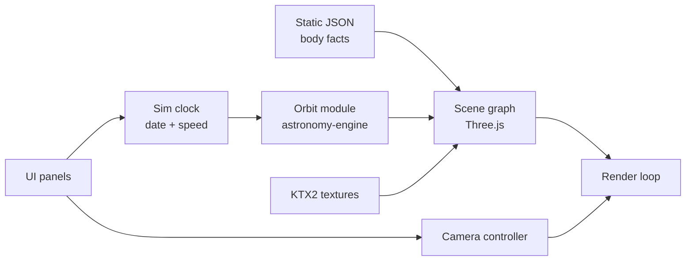

# Solar System — Project Brief

## Overview

Solar System is an interactive, browser-based 3D explorer of the Sun, planets, and major moons. It is fully public: no login, no accounts, no backend. Anyone with the link can open it on desktop or mobile.

The site is static and every computation runs in the browser. That keeps hosting free and leaves nothing to secure.

## Goals and non-goals

The goal is a smooth, good-looking explorer that loads fast on a phone and teaches something on every click.

Goals:

- Render the Sun, 8 planets, and major moons in 3D with orbit paths
- Let users orbit, zoom, and click any body to focus it and see its facts
- Control time: play, pause, speed up, reverse, and jump to a date
- Hit 60 fps on a mid-range laptop and 30+ fps on a mid-range phone
- Keep first load under 3 MB before high-res textures stream in

Non-goals:

- User accounts, login, saved state on a server, or any backend
- Spacecraft missions, comets, and the full asteroid catalog (for now)
- Scientific-grade precision beyond what `astronomy-engine` gives

## Tech stack

The stack is Three.js on a Vite + TypeScript static site, deployed free to a static host.

| Layer | Choice | Why |
| --- | --- | --- |
| 3D rendering | Three.js | Standard WebGL library with OrbitControls, large ecosystem |
| Language and build | TypeScript + Vite | Fast dev server, small production bundles |
| UI panels | Plain TypeScript + CSS (Angular only if UI grows) | Few panels; avoids framework weight |
| Orbital math | `astronomy-engine` (npm) | Real positions for any date, runs client-side |
| Static data | JSON: radii, masses, periods, descriptions | No API calls at runtime |
| Textures | Solar System Scope (CC BY 4.0), NASA imagery | Free, high quality; credit required |
| Asset compression | KTX2 / Basis Universal | Smaller, GPU-ready textures |
| Hosting | Cloudflare Pages or GitHub Pages | Free, public, auto-deploy from GitHub |
| CI | GitHub Actions | Lint, type-check, build on every push |
| Runtime | Node 24 (pinned via .nvmrc) | Current LTS line |

Live calls to NASA JPL Horizons stay out of the runtime. If more precision is ever needed, precompute from it at build time.

## Architecture

A single render loop reads the simulation clock, asks the orbit module for positions, and updates the scene.

Modules stay small and independent: `clock`, `orbits`, `bodies`, `camera`, `ui`, `assets`. The UI only talks to the clock and camera, never to Three.js directly.

## Features by phase

The MVP proves the core loop: see the system, click a planet, move through time.

| Phase | Features |
| --- | --- |
| MVP | Sun + 8 planets, orbit lines, orbit/zoom camera, click-to-focus, info panel, play/pause and speed control |
| v1 | Major moons, date picker with real positions, Saturn rings, labels toggle, starfield skybox, shareable URL state (focused body + date) |
| Later | Asteroid belt (instanced), dwarf planets, scale toggle (true vs readable), guided tours, offline PWA |

Shareable URL state replaces accounts: the link itself carries what the user was looking at.

## Milestones

Six milestones take the project from empty repo to public v1; durations are estimates for part-time work.

| # | Milestone | Done when | Est. |
| --- | --- | --- | --- |
| 1 | Project setup | Vite + TS repo on GitHub, lint/format, CI builds, deploys a blank page to the host | 1–2 days |
| 2 | Static scene | Sun and planets render with textures and lighting; orbit camera works | 3–4 days |
| 3 | Motion and time | Planets move via `astronomy-engine`; play/pause/speed controls work | 3–4 days |
| 4 | Interaction | Click-to-focus with smooth camera tween; info panel from JSON | 3–4 days |
| 5 | MVP polish and launch | Mobile layout, texture compression, perf budget met, credits page, public link | 3–5 days |
| 6 | v1 features | Moons, date picker, rings, labels, skybox, shareable URLs | 1–2 weeks |

## Performance, accessibility, licensing

The site must stay fast on phones, usable without a mouse, and correctly credited.

- **Performance:** load low-res textures first and stream 2K/4K later, use KTX2 compression, cap pixel ratio at 2, use instanced meshes for belts, pause rendering when the tab is hidden.
- **Accessibility:** keyboard controls for camera and time, a text list of bodies as an alternative to clicking in 3D, respect `prefers-reduced-motion`, readable contrast on panels.
- **Licensing:** credit Solar System Scope textures (CC BY 4.0) on a credits page; NASA imagery is public domain but still credited; check each library's license (Three.js and `astronomy-engine` are MIT).

## Open decisions

- [ ] Realistic (true scale, real positions by date) or stylized (compressed distances, exaggerated sizes)? This plan assumes real positions with a readable default scale.
- [ ] Plain TypeScript UI, or Angular from the start?
- [ ] Hosting: Cloudflare Pages or GitHub Pages?
- [ ] Custom domain or subdomain (for example under ravishankardubey.in)?
- [ ] Analytics: none, or a privacy-friendly option with no cookie banner?
